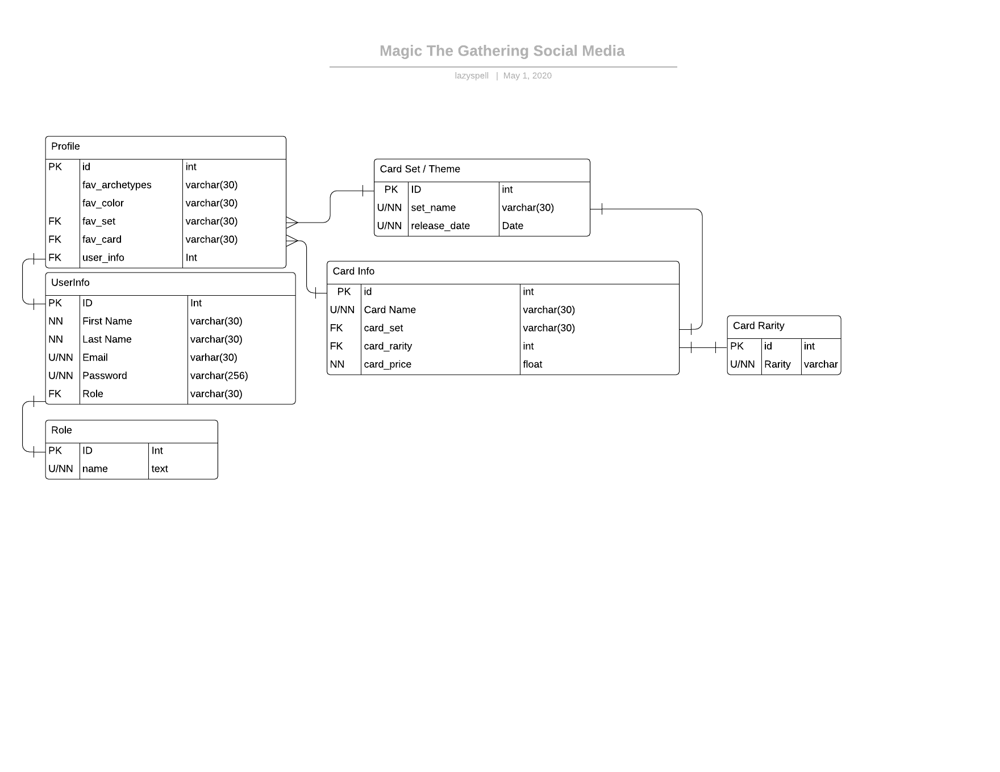

# Project 0
For Project 0, you will be building a RESTful API using TypeScript and Express. Associates are allowed to come up with their own API idea, but it must be approved by the trainer; suggested ideas are provided below.

## Required Features:
  - RESTful API (At least Level 2 of the Richardson Maturity Model)
  - Documentation (all methods have basic documentation)
  - Unit testing (>= 80% coverage)
  - SQL Data Persistance (at least 3 tables; all 3NF)
  - Logging (extra)
  - Authentication/Authorization (extra)

## Tech Stack:
  - TypeScript
  - PostGreSQL
  - node-postgre
  - Express
  - Jest
  - Git SCM (on GitHub)

### Presentation:
 5 minute live demonstration of endpoint consumption using Postman

# My Project 0 Overview - Magic The Gathering Social Media

-	This project will consist of the creation of a social media page for magic the gathering players. The purpose of this social media page will allow users to connect to a database with cards, post on their profile what their favorite card is, what their favorite set is, favoirte archetypes and favorite color.  Users will also be able to find what the current price is of a card is.

	### Data to persist in Database
- Profile (Profile ID, Username, Favorite Archetypes, Favorite Color, Favorite Set, Favorite Card, User ID)
- User Info (User Info ID, First Name, Last Name, Email, Password, Role)
- User Roles (Role ID, Role Name) 
- Card Info(ID, Card Name, Set Name, Card Rarity, Card Price)
- Card Rarity(ID, Card Rarity)
- Card Set (Card Set, Release Date)

